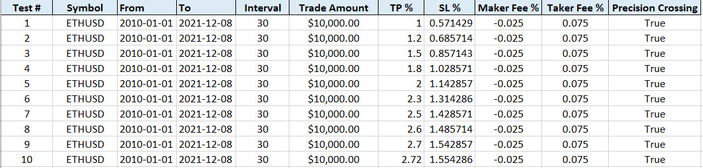
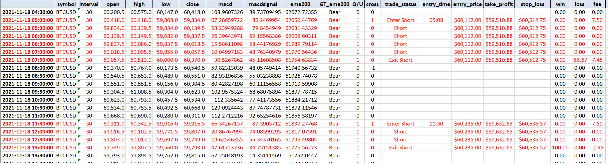
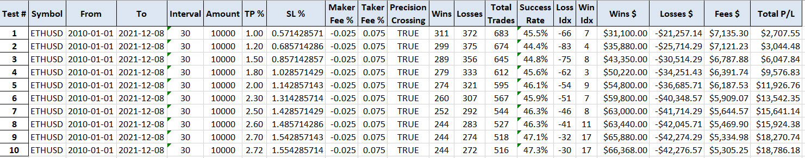

# Back Testing Trading Strategies
Python code that pulls data from Bybit and automates the back testing of a number of trading strategies.

The application takes as input an [Excel file](TestCases.xlsx) with the parameters for each test case. 

 

The backtester will then produce in the [output folder](BackTestingResults) an Excel file containing the market data, indicators and trades for each test case. 

 

The backtester will also generate a [statistics file](BackTestingResults/Statistics.xlsx) with the results to help analyse the performance of the strategy with selected parameters. 

 

